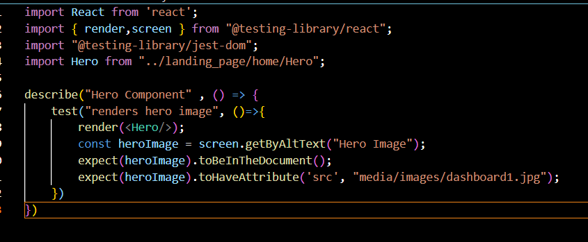
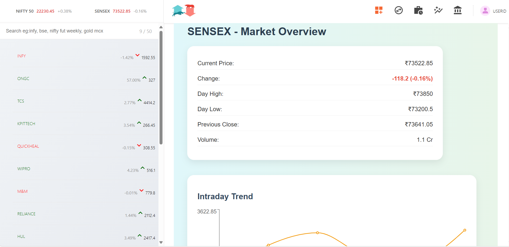
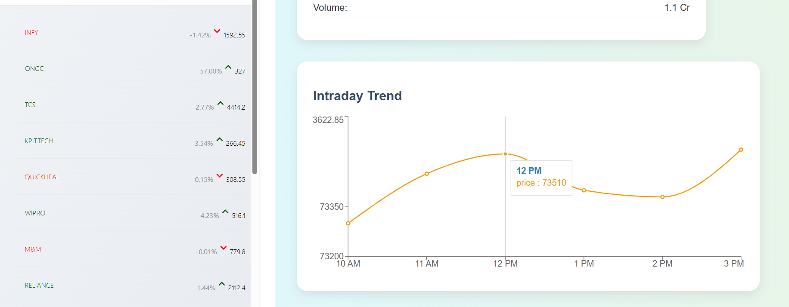
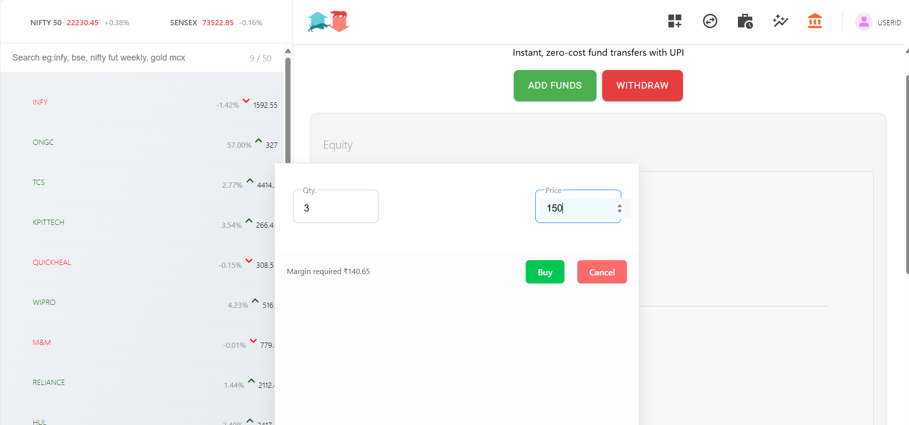

VestCore
VestCore is a financial technology company offering a suite of advanced tools for retail and professional investors. One of its flagship products is ByteVest, a robust stock trading platform that provides secure user authentication, real-time market data, order and fund management, and a seamless dashboard experience.

🚀 Features
🔒 User Authentication
- Secure registration and login using JWT (JSON Web Tokens)
- Password hashing with bcrypt

📈 Market View
- Real-time market data
- Stock prices and performance trends

📊 ByteVest Dashboard
- Buy and sell shares
- Track holdings and positions
- Manage orders
- Add and withdraw funds via UPI or card
- Access profile and logout through a responsive profile menu

🖥️ Dashboard UI
- Interactive and intuitive user interface
- Component-driven architecture with React

🧰 Technology Stack
🚀 Frontend
- React – Component-based UI development
- React Router DOM – Client-side routing
- Material-UI – Pre-built UI components and styling
- Axios – HTTP client for API communication
- Chart.js / Recharts – Data visualization tools

⚙️ Backend
- Node.js – JavaScript runtime environment
- Express.js – RESTful API framework
- MongoDB – NoSQL database for persisting application data
- Mongoose – Object Data Modeling (ODM) for MongoDB
- JWT – Secure token-based authentication
- bcrypt – Password encryption
- dotenv – Environment variable management
- cors – Cross-origin resource sharing
  
🧪 Testing
- This project uses Jest and React Testing Library for unit testing React components.
- ✅ Hero Component Test
- Ensures:
- Component renders successfully
- Hero image exists with the correct alt and src attributes
- Example Test Code:
- 
               
🛠️ Installation & Setup
📦 Prerequisites
- Node.js and npm
- MongoDB (local or hosted, e.g., MongoDB Atlas)
- 
📥 Clone the Repository
- git clone https://github.com/your-user-name/vestCore.git
- cd vestCore
🔐 Configure Environment Variables
- Create a .env file in the backend directory with the following values:
- PORT=3002
- MONGO_URI=your-mongodb-connection-string
- TOKEN_KEY=your-secret-key
📦 Install Dependencies
- Backend
- cd backend
- npm install

- Frontend
- cd ../frontend
- npm install

- Dashboard
- cd ../dashboard
- npm install
- 
▶️ Start the Applications
- Start Backend
- cd backend
- npm start

- Start Frontend
- cd ../frontend
- npm start

- Start Dashboard
- cd ../dashboard
- npm start
🌐 Access Points
- Frontend: http://localhost:3000

- Dashboard: http://localhost:3001

- Backend API: http://localhost:3002

📷 Dashboard Preview

🤝 Contributing
Pull requests are welcome. For major changes, please open an issue first to discuss what you would like to change.

📄 License
This project is licensed under the MIT License.

Feel free to reach out with questions or ideas via GitHub Issues or Discussions!
