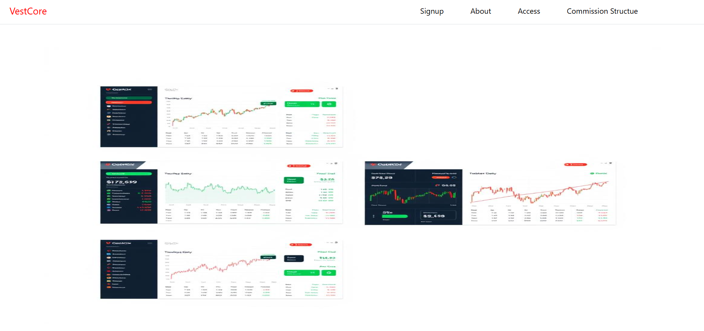
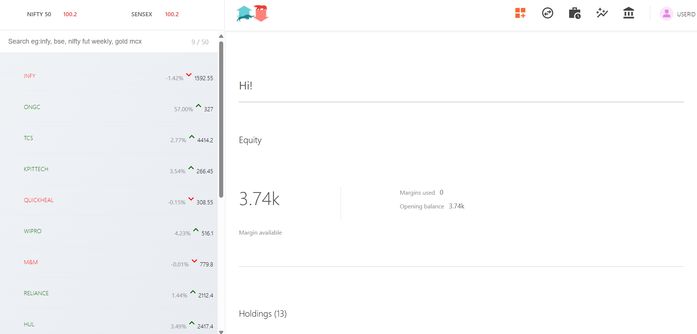
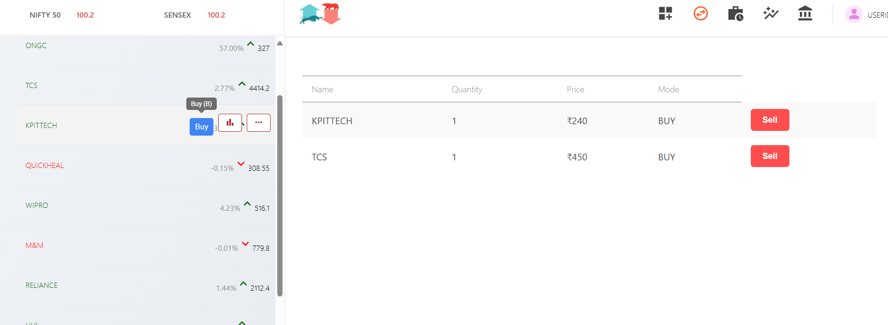
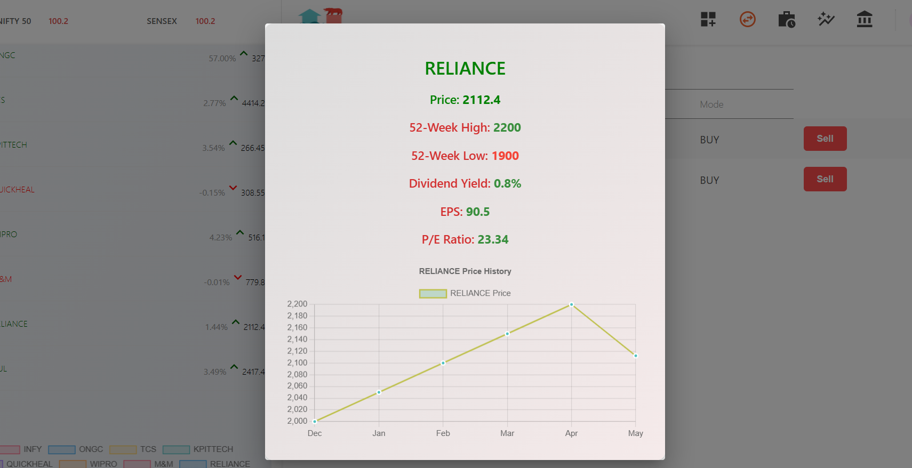
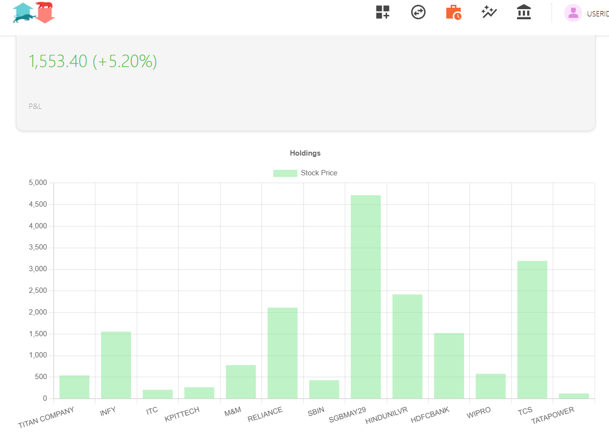

**VestCore** is a company that has developed a suite of financial tools. One of its core products is **ByteVest**, a full-featured stock trading platform. This platform includes user authentication, fund management,  market data viewing, and a comprehensive trading dashboard.

Features
- User Authentication: Secure login and registration using JWT.
- 📈  Market View
    Displays market data, stock prices and trends.
- 📊 ByteVest Dashboard :
- Buy & Sell Shares
- Holdings & Positions displays updates
- Order Management
- Add Funds using UPI or card
- Withdraw Funds
- Profile Menu

-    
-    
-  
-  
  
-Technology Stack

🚀 Frontend
- React - Building fast, component-based UIs
- React Router - Routing
- Material-UI – UI components and styling.
- React Router DOM – Client-side routing between pages.
- Axios – API requests to the backend.
- Chart.js / Recharts – for visualizing market data.

⚙️ Backend
- Node.js – Runtime environment.
- Express.js – RESTful API development.
- MongoDB – NoSQL database for storing user data, orders, positions, holdings, and funds.
- Mongoose – MongoDB object modeling.
- JWT – Secure token-based user authentication.
- bcrypt – Password hashing.
- dotenv – Environment variable management.
- cors – Cross-origin support for frontend-backend interaction.

Installation and Setup 

### Clone the Repo:
-git clone https://github.com/your-user-name/vestCore.git
- cd vestCore

### Backend Setup
1. cd backend
2. npm install
3. Create a .env file in the backend directory.
 PORT=3002
 MONGO_URI=your-mongodb-connection
 TOKEN_KEY=your-secret-key

5. Run the backend server
npm start

### Dashboard Setup
1. cd ../dashboard
2. npm install
3. npm start

### Frontend Setup
1. cd ../frontend
2. npm install
3. npm start

###
Frontend will run at: http://localhost:3000 
#
 Dashboard at: http://localhost:3001
 #
 Backend at: http://localhost:3002
