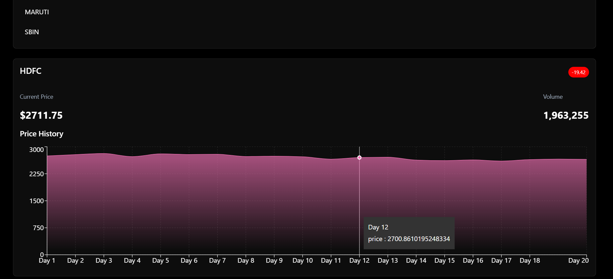

**VestCore** is a company that has developed a suite of financial tools. One of its core products is **ByteVest**, a full-featured stock trading platform. This platform includes user authentication, fund management,  market data viewing, and a comprehensive trading dashboard.

<<<<<<< HEAD
Features
- User Authentication: Secure login and registration using JWT.
- 📈  Market View
    Displays market data, stock prices and trends.
- 📊 ByteVest Dashboard :
- Buy & Sell Shares
- Holdings & Positions displays updates
- Order Management
- Add Funds using UPI or card
- Withdraw Funds
- Profile Menu

-    
-    
-  
-  
-  
  
-Technology Stack

🚀 Frontend
- React - Building fast, component-based UIs
- React Router - Routing
- Material-UI – UI components and styling.
- React Router DOM – Client-side routing between pages.
- Axios – API requests to the backend.
- Chart.js / Recharts – for visualizing market data.

⚙️ Backend
- Node.js – Runtime environment.
- Express.js – RESTful API development.
- MongoDB – NoSQL database for storing user data, orders, positions, holdings, and funds.
- Mongoose – MongoDB object modeling.
- JWT – Secure token-based user authentication.
- bcrypt – Password hashing.
- dotenv – Environment variable management.
- cors – Cross-origin support for frontend-backend interaction.

Installation and Setup 

### Clone the Repo:
git clone https://github.com/your-username/vestCore.git
cd vestCore
### Backend Setup
1. cd backend
2. npm install
3. Create a .env file in the backend directory.
 PORT=3002
 MONGO_URI=your-mongodb-connection
 TOKEN_KEY=your-secret-key
5. Run the backend server
npm start

### Dashboard Setup
1. cd ../dashboard
2. npm install
3. npm start

### Frontend Setup
1. cd ../frontend
2. npm install
3. npm start

###
Frontend will run at: http://localhost:3000 
#
 Dashboard at: http://localhost:3001
 #
 Backend at: http://localhost:3002
=======
## 🔧 Tech Stack

### 🚀 Frontend
- **React** – Building fast, component-based UIs.
- **Material-UI** – UI components and styling.
- **React Router DOM** – Client-side routing between pages.
- **Axios** – API requests to the backend.
- **Chart.js / Recharts** – (if used) for visualizing market data.

### ⚙️ Backend
- **Node.js** – Runtime environment.
- **Express.js** – RESTful API development.
- **MongoDB** – NoSQL database for storing user data, orders, positions, holdings, and funds.
- **Mongoose** – MongoDB object modeling.
- **JWT** – Secure token-based user authentication.
- **bcrypt** – Password hashing.
- **dotenv** – Environment variable management.
- **cors** – Cross-origin support for frontend-backend interaction.

---

## ✨ Features

### 🔒 Authentication
- Secure signup and login using **JWT**
- User sessions managed securely

### 💸 Fund Management
- **Add Funds** using UPI or card
- **Withdraw Funds** 

### 📊 ByteVest Dashboard
- **Buy & Sell Shares**
- **Holdings & Positions** display updates
- **Order Management**
- **Profile Menu** (Profile, Logout, etc.)
  
### 📈  Market View (Frontend)
- Displays market data, stock prices, and trends.
  
### 🧪 Testing
This project uses Jest and React Testing Library for unit testing of React components.
✅ Hero Component Test
The Hero component is tested to ensure:
It renders correctly.


  ---

## 🛠️ Installation

### Prerequisites
- **Node.js** and **npm** installed
- **MongoDB** (local or [MongoDB Atlas](https://www.mongodb.com/cloud/atlas))

### Steps

1. Clone the repository:
```bash
git clone https://github.com/Aradhanakuradiya/vestCore.git
cd vestCore

2. Configure Environment Variables:
Create a .env file in the backend directory.
PORT=3002
MONGO_URI=your-mongodb-connection
TOKEN_KEY=your-secret-key

3. Install Dependencies
Backend
cd backend
npm install

Frontend
cd ../frontend
npm install

Dashboard
cd ../dashboard
npm install

4. Start the Applications:
Backend
cd backend
npm start

Frontend
cd ../frontend
npm start

Dashboard
cd ../dashboard
npm start


>>>>>>> 8810244 (Add dashboard screenshot to README)
